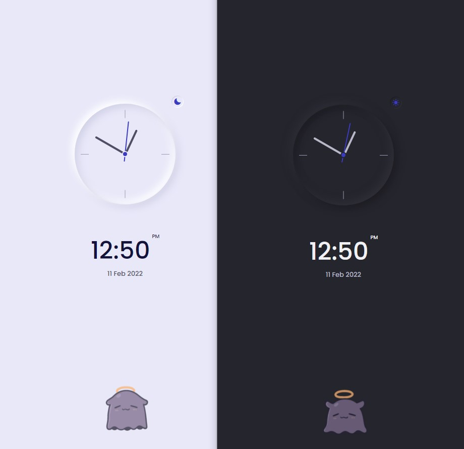

# Responsive Analog Clock using HTML, CSS & Javascript

## Done following tutorial by [Bedimcode YouTube](https://www.youtube.com/watch?v=H4-lcB3dr-Q)
## Deployed at https://mrjiahoe.github.io/html-analog-clock-tutorial/

